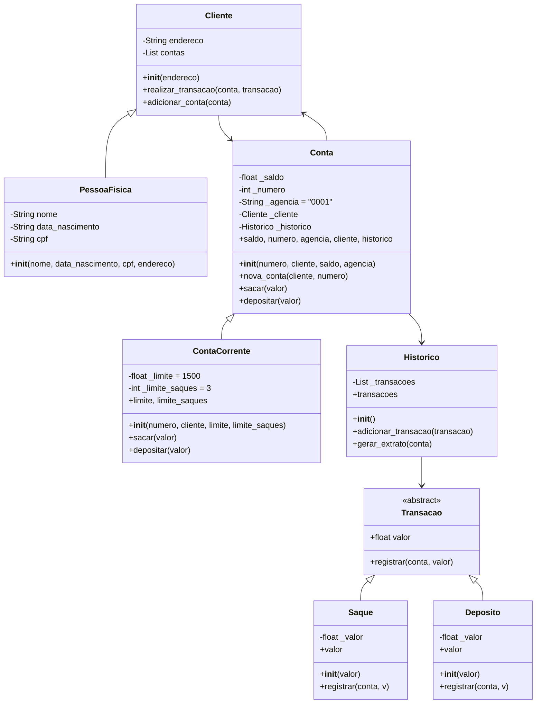

# <h1 align="center">🏦 Sistema Bancário Modularizado em Python</h1> 
Este repositório reúne os principais aprendizados adquiridos durante o Bootcamp **Luizalabs - Back-end com Python**, módulo **Dominado Funções e Boas Práticas em Python** e módulo **Programação Orientada a Objetos (POO) com Python** da plataforma [DIO.me](https://web.dio.me).
O desafio do projeto tem como objetivo a construção de um sistema bancário simples, modularizado e funcional utilizando a linguagem Python.
Ele simula operações bancárias básicas como depósito, saque, visualização de extrato, cadastro de usuários e contas, seguindo boas práticas de programação e regras específicas de passagem de argumentos.

## 📌 Funcionalidades
- [x] Depósito (argumentos apenas por posição)
- [x] Saque (argumentos apenas por nome)
- [x] Visualização de extrato (argumentos por posição e nome)
- [x] Cadastro de usuário com validação de CPF único
- [x] Cadastro de conta bancária vinculada ao usuário
- [x] Listagem de contas cadastradas
- [x] Validação de dados de entrada (nome, CPF, data de nascimento)
- [x] Vinculação de transações a contas específicas

## 🏁 Regras de Argumentos


| Função               | Tipo de Argumento         | Argumentos Principais                                                 | Retorno                        |
|----------------------|----------------------------|----------------------------------------------------------------------|--------------------------------|
| `depositar`          | Posicional (`/`)           | `saldo`, `valor`, `extrato`                                          | novo `saldo`, novo `extrato`  |
| `sacar`              | Nomeado (`*`)              | `saldo`, `valor`, `extrato`, `limite`, `numero_saques`, `limite_saques` | novo `saldo`, novo `extrato`, `numero_saques` |
| `visualizar_extrato` | Posicional + Nomeado        | `saldo` (posicional), `extrato` (nomeado)                           | impressão do extrato           |
| `cadastrar_usuario`  | Nomeado                    | `nome`, `data_nascimento`, `cpf`, `endereco`                         | novo usuário na lista          |
| `cadastrar_conta`    | Nomeado                    | `cpf` do usuário, `agencia`, `numero_conta`                          | nova conta na lista            |


## 🧩 Estrutura de Dados (exemplo)
Usuário
```
{
  "nome": "Maria Silva",
  "data_nascimento": "01-01-1990",
  "cpf": "12345678901",
  "endereco": "Rua A, 123, Centro, Cidade/UF"
}

```

Conta
```
{
  "agencia": "0001",
  "numero_conta": 1,
  "usuario": {...},  # objeto do usuário
  "saldo": 0.0,
  "extrato": [],
  "numero_saques": 0
}
```

## 🚦Como Executar
1. Clone o repositório:
```
git clone https://github.com/seu-usuario/sistemabancario-dio.git
```
2. Execute o script principal: python sistemabancario.py
3. Siga o menu interativo para realizar operações bancárias.

## 🖥️ Tecnologias Utilizadas
- Python 3.10+
- Programação procedural com funções
- Validação de dados com datetime e expressões regulares

## 🛡️ Validações Implementadas
- CPF com dígitos numéricos
- Data de nascimento válida no formato dd-mm-aaaa
- Endereço com estrutura mínima

## 📦 Melhorias Futuras
- Autenticação por CPF ✅
- Vincular Operações e Extrato à Conta ✅
- Validação de Dados na Criação de Usuário ✅
- Bloqueio e exclusão de contas
- Persistência de dados em arquivos JSON ou banco SQLite

## 📊 Diagrama UML


## 📶 Principais Conexões
- Transacao é abstrata → gera Saque e Deposito.
- Cliente → especializado em PessoaFisica.
- Conta → especializada em ContaCorrente.
- Conta → tem relação de composição com Cliente e Historico.
- Cliente → mantém uma lista de Conta.
- Historico → armazena transações ligadas à Conta.


## 👩‍💻 Desenvolvedora
Izaura TM - responsável pelo projeto.

## 📫 Contribuições
Sinta-se à vontade para abrir issues ou enviar pull requests com melhorias, sugestões ou novas funcionalidades!

---

> Este conteúdo faz parte do projeto **Otimizando o Sistema Bancário com Funções Python e Modelando o Sistema Bancário em POO com Python - Laboratório** da plataforma DIO.me.

📎 Link do curso: [DIO.me](https://web.dio.me/home) 

---

### Licença

Este projeto está licenciado sob os termos da [Licença MIT](LICENSE).


